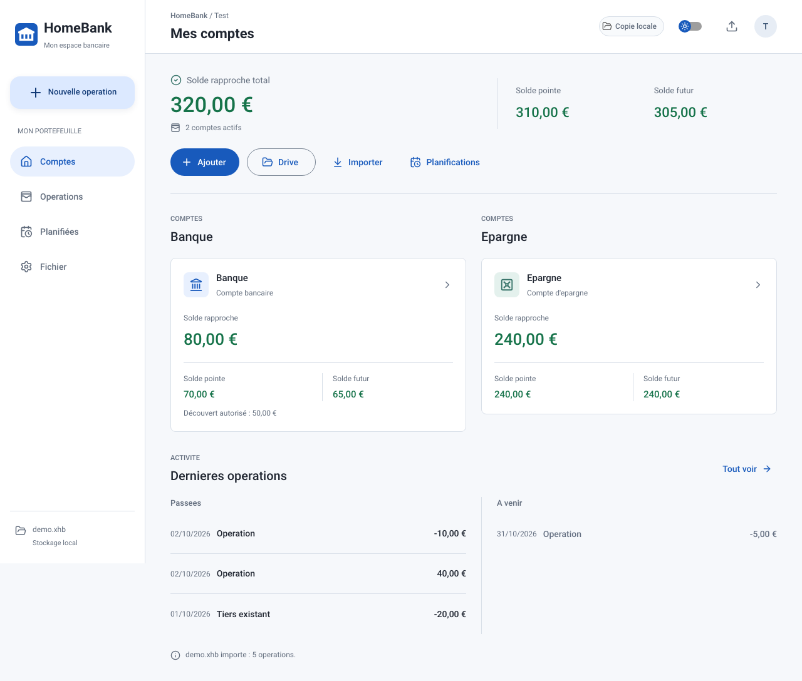
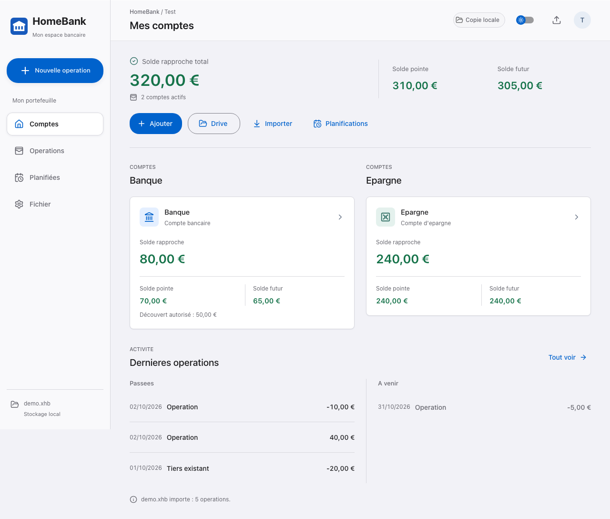
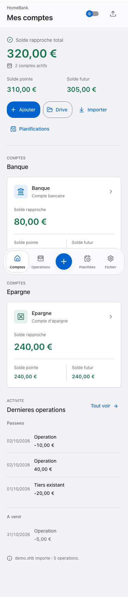
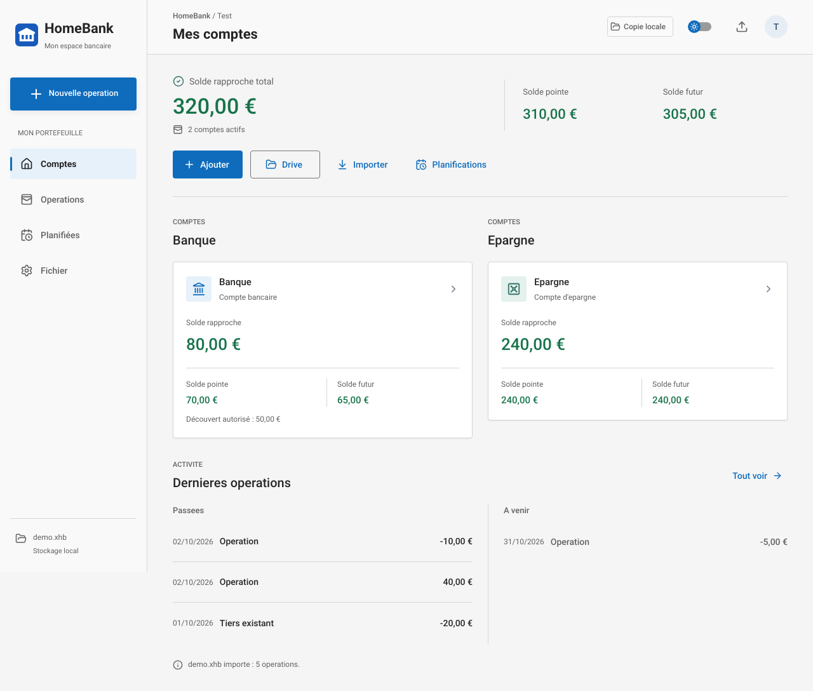

# Revue du design bancaire

Date : 7 octobre 2026.

## Principes retenus

Application de gestion repetee, pas une page commerciale : soldes rapproches prioritaires, listes lisibles, actions explicites, navigation stable et contenu financier opaque. Les variantes changent la presentation, pas les calculs, fichiers, permissions Drive ou parcours d'enregistrement.

| Constat | Adaptation |
| --- | --- |
| Apparence Material unique sur toutes les plateformes | Detection OS/runtime ; trois jeux de tokens, polices et controles |
| Contours des champs faibles sur fond clair | Bordures renforcees, contraste verifie >= 3:1 sur leurs surfaces |
| Risque de confusion avec des donnees transparentes/decoratives | Verre/acrylique limites au chrome ; comptes, listes, formulaires et agendas opaques |
| Actions petites sur telephone | Commandes de 48 px dans la disposition mobile et sur pointeur tactile ; grille compacte du calendrier conservee |
| Nom de compte tronque | Retour a la ligne possible sans masquer les soldes |
| Seuil de decouvert essentiellement exprime par couleur | Seuil affiche et signalement accessible du depassement ; signes/statuts conserves |
| Recherche vide proposant de reimporter le fichier existant | Etat explicite sans commande de remplacement |
| Incoherence possible entre MUI et CSS | Tokens de palette partages |
| Effets incompatibles avec certaines preferences d'accessibilite | Transparence reduite, contraste renforce, couleurs forcees et mouvements reduits |

## Choix automatique

| Plateforme | Design | Signaux |
| --- | --- | --- |
| macOS Electron | Apple | process.platform via preload isole |
| Windows Electron | Fluent | Meme pont natif, sans exposer Node |
| Linux Electron | Material | Repli natif |
| iOS / Android Capacitor | Apple / Material | Capacitor.getPlatform |
| Web macOS/iOS/iPadOS | Apple | Client Hints, platform, user-agent ; iPad en mode desktop pris en compte |
| Web Windows | Fluent | Signaux navigateur |
| Web Android/ChromeOS/Linux/inconnu | Material | Design par defaut |

La detection concerne l'OS, pas le navigateur : Chrome sur macOS garde Apple, Edge sur Android garde Material. Le signal natif prime. La detection ne donne aucun droit d'acces aux API privilegiees. Sur le web elle reste une estimation, modifiable par les protections du navigateur, avec repli Material.

## Trois variantes

### Material

Roboto local, surfaces tonales, commandes arrondies, selection coloree et interactions Material. MUI conserve. [Material 3](https://m3.material.io/foundations/) recommande hierarchie, tokens et roles de couleur coherents.

### Apple

Police systeme, controles segmentes, chrome translucide/reflet discret et navigation mobile flottante. Les donnees bancaires restent opaques. Les [materiaux Apple](https://developer.apple.com/design/human-interface-guidelines/materials) servent la separation navigation/contenu et doivent respecter les preferences d'accessibilite.

### Fluent

Segoe UI lorsqu'elle est disponible, angles compacts, commandes rectangulaires, surfaces neutres et marqueur de selection lateral. Chrome legerement acrylique lorsque disponible. Declinaison des principes [naturel sur la plateforme et construit pour le focus](https://fluent2.microsoft.design/design-principles).

## Accessibilite

- Tests des paires de couleurs principales : textes/montants/libelles >= 4.5:1 sur les surfaces opaques ; contours de champs >= 3:1.
- Signes, devise et chiffres tabulaires conserves ; statuts textuels avec icones, pas seulement couleur.
- Focus clavier, labels associes aux champs et dialogues MUI conserves.
- Reduire la transparence : Fichier > Accessibilite, choix persistant ; une preference systeme plus restrictive prime.
- Web/Capacitor : prefers-reduced-transparency, prefers-contrast, forced-colors et prefers-reduced-motion lorsqu'ils sont exposes.
- Electron : preferences natives initiales et changements systeme suivis par IPC borne au cadre principal. [nativeTheme](https://www.electronjs.org/docs/latest/api/native-theme) fournit les preferences, sans modifier les reglages OS.
- Sans backdrop-filter, chrome opaque. Aucun shader, lentille ou animation continue ajoute.

Ces controles ne sont pas une certification WCAG exhaustive. VoiceOver/TalkBack, zoom utilisateur, reglages iOS et ecrans Windows reels restent a verifier.

## Implementation et limites

Detection pure dans src/lib/platform.ts, palettes/MUI dans src/theme.ts, preferences dans AppearanceProvider et variantes dans src/platforms.css. Pont Electron en lecture seule dans main.cjs/preload.cjs. Pas de nouvelle bibliotheque UI.

Adaptations web inspirees de Liquid Glass et Fluent, pas des controles SwiftUI/WinUI ni le moteur optique natif Apple. Les polices systeme ne sont ni telechargees ni redistribuees ; leurs fallbacks peuvent modifier les captures prises sur un autre OS.

## Verification

Resultats : **176 tests unitaires et 123 tests navigateur reussis**, builds web/native et smoke Electron macOS. Six captures de reference dans docs/design. La logique bancaire reste partagee entre les variantes.

Tests unitaires OS natif prioritaire, iPad, ChromeOS, repli et contraste. Matrice Playwright Material/Apple/Fluent, clair/sombre, desktop/telephone : comptes, operations, ajout, calendrier et accessibilite. Captures sur donnees fictives et mesures de debordement. Tests metier existants conserves.

Les clients installes doivent etre reconstruits pour recevoir ces changements. Validation sur appareils reels distincte de Chromium emule et du smoke Electron.
