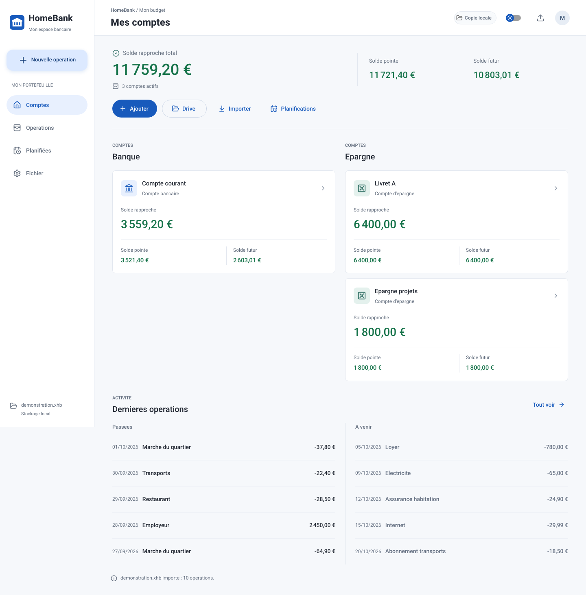
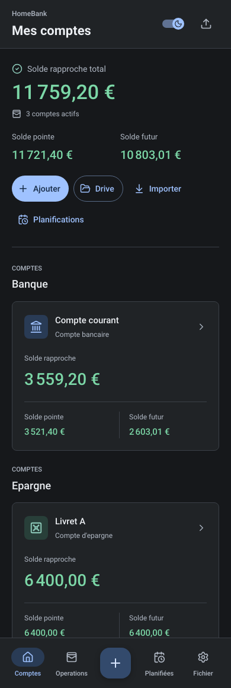
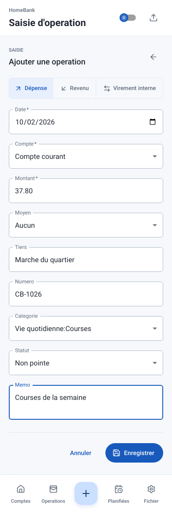
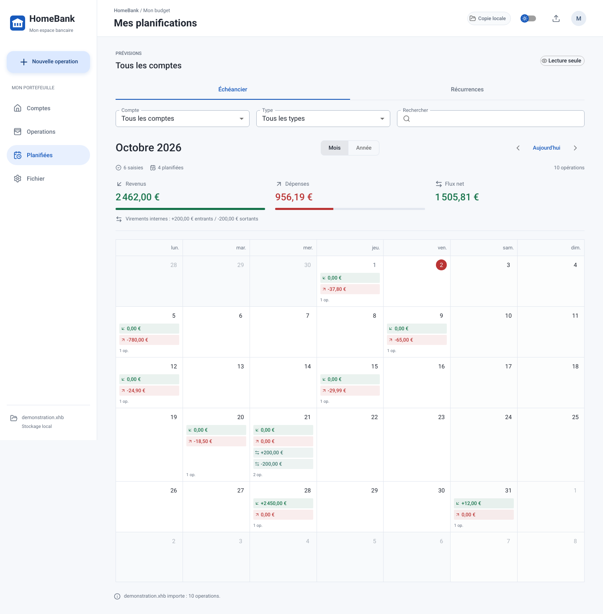
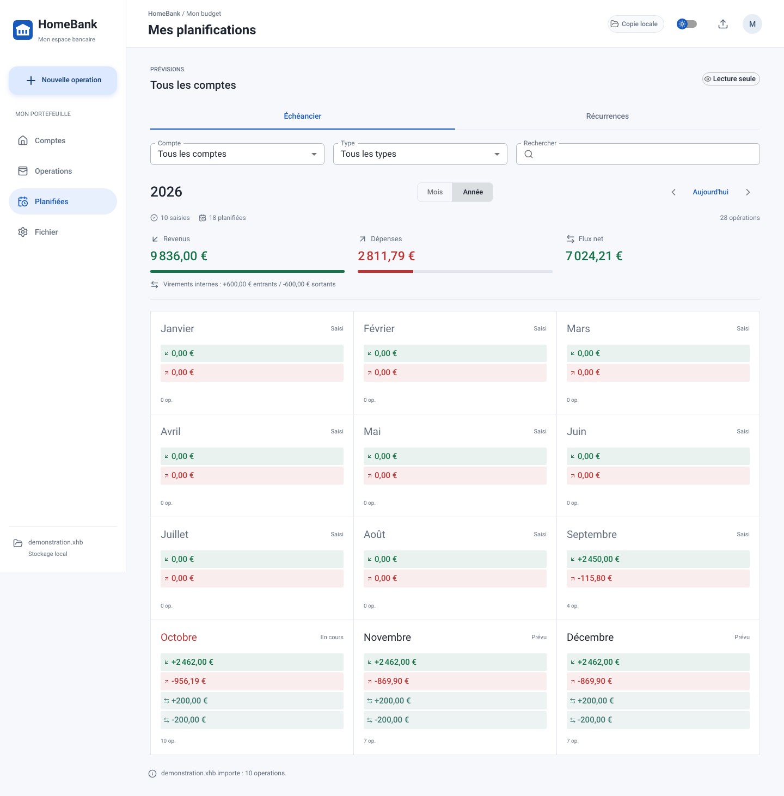

# HomeBank Web

L'interface suit votre appareil : **Material** sur Android/ChromeOS et par defaut, **Apple Liquid Glass adapte** sur iOS/macOS, **Fluent adapte** sur Windows. Clair et sombre sont disponibles dans les trois variantes. [Voir les variantes et la revue du design](DESIGN_REVIEW.md).

**Votre HomeBank, partout avec vous.**

Consultez vos comptes, saisissez une dépense depuis votre smartphone et anticipez vos prochaines échéances. HomeBank Web prolonge votre gestion HomeBank dans une interface bancaire claire, adaptée à l'ordinateur comme au mobile, tout en conservant votre fichier `.xhb`.

[Découvrir les fonctionnalités](#vos-finances-en-un-coup-dœil) · [Voir l'expérience mobile](#pensé-pour-le-quotidien-sur-mobile) · [Installer et déployer](README_TECHNIQUE.md)

*Captures de l'application réelle, réalisées avec des comptes et des opérations entièrement fictifs.*

## Vos finances en un coup d'œil

Retrouvez l'essentiel dès l'ouverture : vos comptes actifs, votre épargne et les mouvements qui comptent aujourd'hui.

| Fonctionnalité | Ce qu'elle vous apporte |
| --- | --- |
| Banque et épargne séparées | Une lecture immédiate de votre argent disponible et de vos réserves. |
| Soldes rapproché, pointé et futur | Le solde rapproché en principal, avec les autres soldes pour suivre l'évolution de vos comptes. |
| Découvert pris en compte | Des soldes verts, orange ou rouges selon la situation et l'autorisation de chaque compte. |
| Activité récente et à venir | Les cinq dernières opérations passées et les cinq prochaines opérations futures. |
| Recherche et filtre par compte | Un accès rapide à l'opération que vous cherchez. |
| Pointage et rapprochement | Des actions directes pour garder vos comptes à jour. |

Les comptes désactivés restent dans votre fichier HomeBank, mais ne viennent pas encombrer votre tableau de bord.

Besoin de consulter un ancien compte ? Activez **Inclure les comptes clos** dans la vue Opérations ou dans le calendrier de l'Échéancier. Vos archives deviennent consultables sans modifier la page Comptes, qui reste réservée aux comptes ouverts.

## Pensé pour le quotidien sur mobile

Une dépense à noter après un achat ? Un revenu à enregistrer ? Un virement entre deux comptes ? La saisie reste accessible depuis la navigation, avec des champs distincts pour le tiers, le numéro de paiement et le mémo.

<table>
  <tr>
    <th>Vos comptes en thème sombre</th>
    <th>Une opération en quelques champs</th>
  </tr>
  <tr>
    <td align="center"></td>
    <td align="center"></td>
  </tr>
</table>

- **Dépenses, revenus et virements internes** : les deux mouvements d'un virement sont liés et mis à jour ensemble.
- **Catégories hiérarchisées** : retrouvez les chemins `catégorie:sous-catégorie` de votre fichier HomeBank.
- **Interface Material Design** : navigation latérale sur ordinateur, navigation basse sur mobile.
- **Thème clair ou sombre** : détection du thème du système et choix manuel mémorisé.
- **Accès depuis l'écran d'accueil** : installation comme application web sur les navigateurs compatibles.

## Anticipez vos prochaines échéances

Loyers, abonnements, revenus récurrents ou épargne régulière : consultez les planifications de votre fichier, regroupées par compte, avec une vue d'ensemble des revenus, dépenses et flux nets prévus.

- **Calendrier mensuel** : revenus et dépenses par jour, avec la liste des opérations au clic.
- **Calendrier annuel** : totaux par mois, détail des opérations et accès au calendrier du mois sélectionné.
- **Historique et prévisions** : toutes les opérations inscrites dans les comptes sont visibles, même avec une date future. À partir de demain, les échéances encore planifiées s'y ajoutent. Les virements affichent leurs totaux entrants et sortants séparément.
- **Récurrences** : la prochaine échéance de chaque planification, même au-delà du mois courant.
- **Vue générale ou par compte** : les totaux suivent l'onglet et les filtres sélectionnés.
- **Virements internes distincts** : ils participent au flux net sans gonfler les revenus ou les dépenses.
- **Détail des planifications** : fréquence, échéances restantes, report du week-end et informations de l'opération.

La consultation des planifications est actuellement en lecture seule : elle ne crée pas d'opérations et ne change pas les soldes.

## Votre fichier, votre façon de travailler

**Continuez avec HomeBank.** Importez votre fichier `.xhb`, puis exportez une copie à rouvrir dans l'application de bureau. Les comptes masqués et les données non éditables sont conservés dans le fichier.

**Connectez votre Google Drive, si vous le souhaitez.** Choisissez votre fichier dans Drive : les ajouts et modifications d'opérations sont ensuite sauvegardés automatiquement sous forme de nouvelles révisions. Un indicateur signale les interruptions et les sauvegardes en attente.

**Gardez une copie locale.** Les modifications sont d'abord enregistrées dans le navigateur. Une fois l'application et le portefeuille chargés, la consultation et la saisie restent possibles hors ligne ; la synchronisation reprend au retour du réseau, si l'autorisation Google est valide. Une reconnexion peut demander une action de votre part.

HomeBank Web ne se connecte pas directement à votre banque : il travaille sur votre fichier HomeBank, local ou choisi dans Google Drive.

## Pour commencer

1. Ouvrez une instance de HomeBank Web déployée par vos soins ou votre administrateur.
2. Importez un fichier `.xhb`, ou choisissez-le dans Google Drive si l'intégration est configurée.
3. Consultez vos comptes, ajoutez vos opérations et retrouvez vos planifications.

Pour lancer l'application sur votre machine ou la publier : **[guide technique d'installation et de déploiement](README_TECHNIQUE.md)**.

Pour générer les installateurs macOS/Windows, les applications iOS/Android et les releases GitHub : **[guide de packaging](README_PACKAGING.md)**, avec les prérequis de signature et les limites de l'intégration Drive native.

## Une première version déjà utilisable

HomeBank Web est encore un MVP. La création des planifications, l'édition des opérations ventilées et la résolution des conflits entre appareils ne sont pas disponibles. Les totaux du tableau de bord supposent une même devise ; les prévisions séparent les devises sans conversion.

Conservez une sauvegarde de votre fichier avant les premiers essais et évitez de le modifier simultanément depuis plusieurs appareils. Le guide technique précise les [limites et précautions](README_TECHNIQUE.md#limites-et-precautions).
